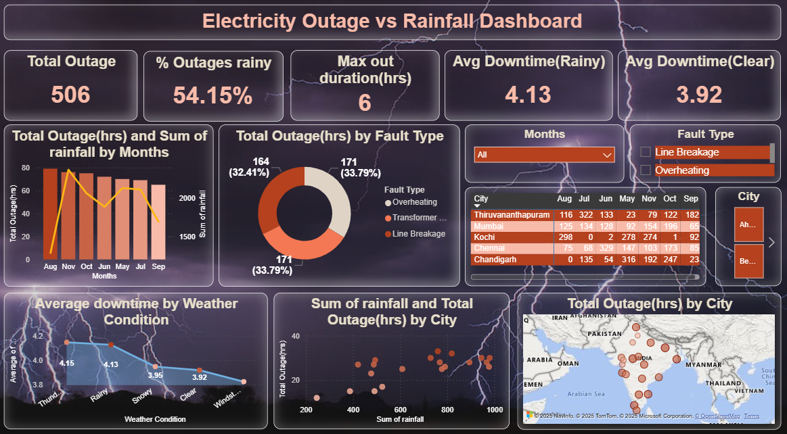

# ⚡ Electricity Outage vs Rainfall Dashboard

### 🚀 ThunderByte 2025 Hackathon Project  

This project analyzes the relationship between **rainfall patterns** and **electricity outages** across Indian cities.  
Using **Power BI**, we designed an **interactive 1-page dashboard** that uncovers patterns in outage frequency, causes, and downtime under varying weather conditions.  

---

## 📊 Dashboard Preview

---

## 🎯 Problem Statement
Electricity outages increase significantly during the monsoon season, but the impact varies by city, weather type, and fault type.  
Our goal was to explore **"Electricity Outage vs Rainfall"** and answer:

- How does rainfall intensity affect outage frequency & duration?  
- Which cities are most impacted during monsoon?  
- What fault types are dominant during rainy conditions?  
- How does downtime differ in rainy vs clear weather?  

---

## 🛠️ Tools & Technologies
- **Power BI** – Data visualization & dashboard design  
- **Excel/CSV Data** – Outage & rainfall dataset  
- **GitHub** – Project sharing & version control  

---

## 🔑 Key Insights
- **54.15%** of total outages occurred during **rainy conditions**.  
- Maximum outage duration reached **6 hours** in a single event.  
- Average downtime was slightly **higher in rainy weather (4.13 hrs)** vs **clear weather (3.92 hrs)**.  
- **Line Breakage** and **Overheating** were the top causes of outages.  
- Cities like **Chennai, Kochi, and Mumbai** showed frequent outage spikes during peak monsoon.  

---

## 📌 Dashboard Features
- **KPI Cards**: Total outages, % outages in rainy weather, max outage duration, avg downtime.  
- **Charts**:
  - Outage hours vs Rainfall by Month (Bar + Line Combo)  
  - Outage hours by Fault Type (Donut Chart)  
  - Average downtime by Weather Condition (Line Chart)  
  - Rainfall vs Outages Scatter Plot (City-wise)  
  - Outages by City (Map Visualization)  
  - Interactive Table with City & Month filters  
- **Slicers** for Month, City, and Fault Type  

---

## 🏆 Hackathon Edge
✅ Clean one-page storytelling layout  
✅ Weather-themed background for impact  
✅ Interactive filters for exploratory analysis  
✅ Strong connection to the **“Tech for a Rainy Day”** theme  

---

